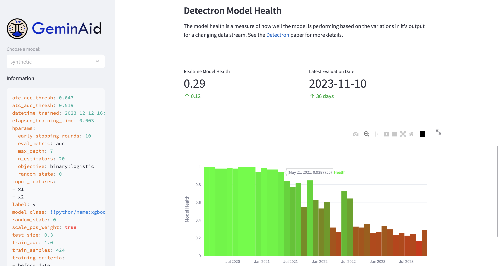

# Geminaid realtime model monitoring dashboard



## Running the app

For now, the app is designed to run locally using synthetic data.
To run the app, first install the requirements and then run the app with
streamlit.

```shell
pip install -r requirements.txt
PYTHONPATH=. streamlit run app/geminaid.py
```
